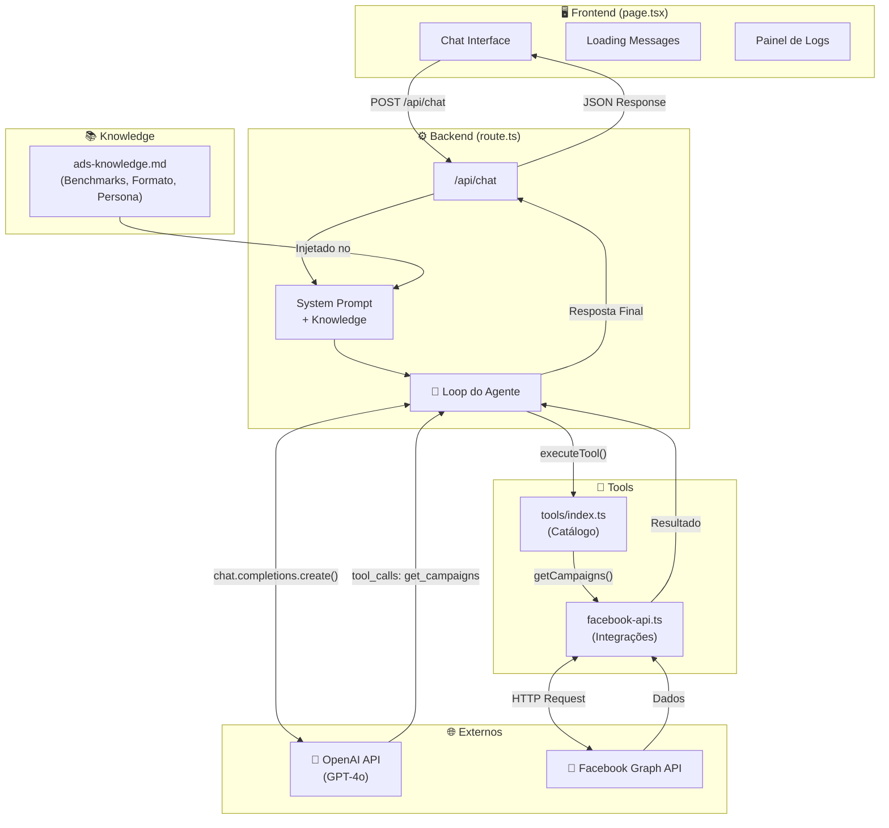
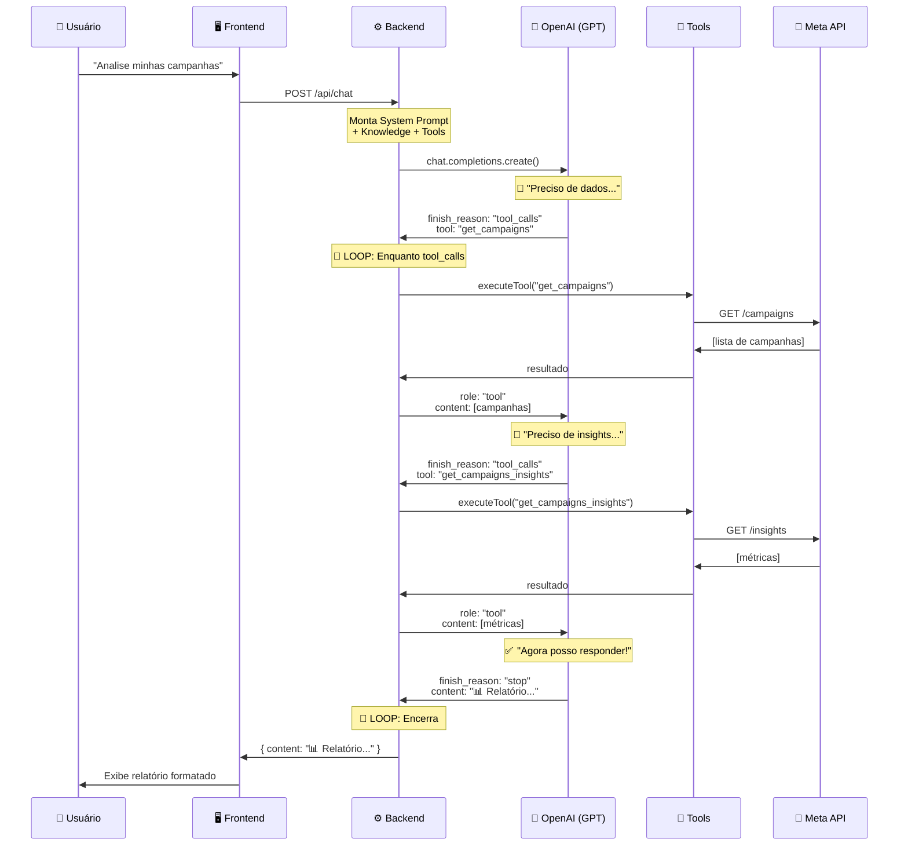
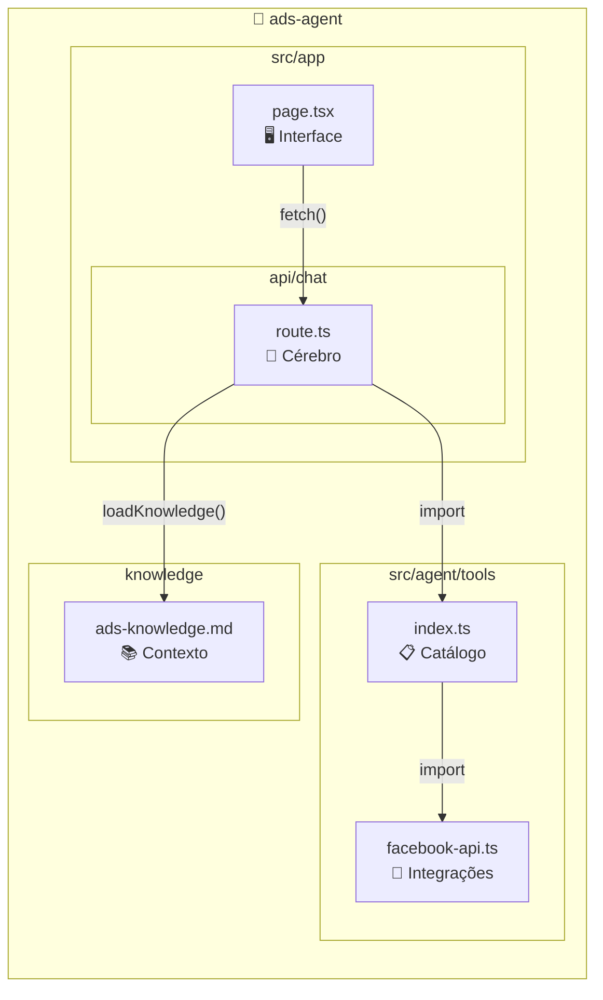
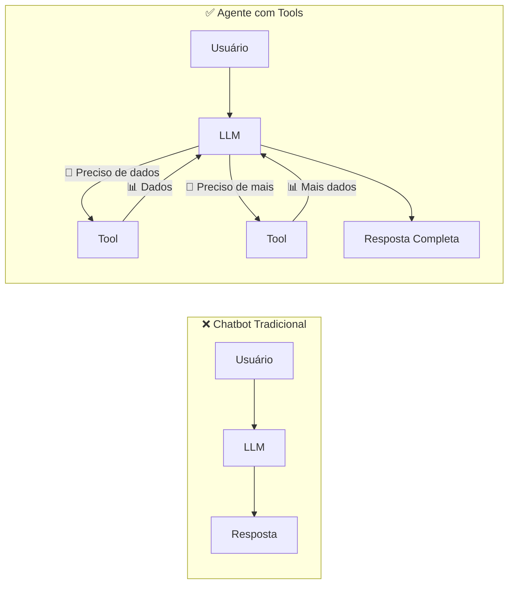
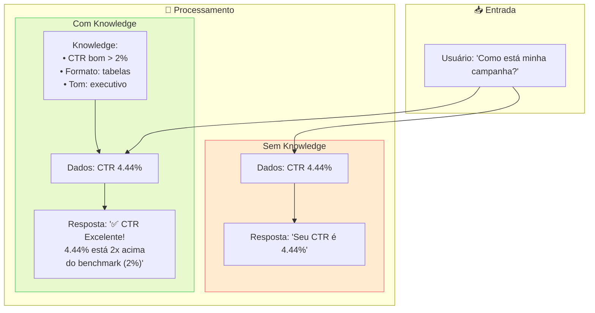
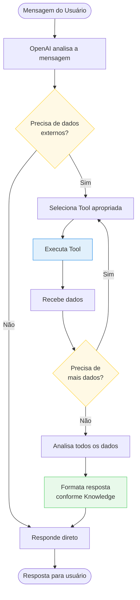
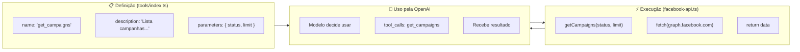
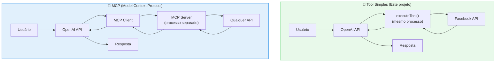

# 🤖 AI Agent Ads - Diagramas de Arquitetura

> Diagramas explicativos do funcionamento do agente de tráfego.
> Visualize em: https://mermaid.live

---

## 1. Arquitetura Geral do Agente

---

## 2. O Loop do Agente (A Mágica)

Este é o coração do agente. O LLM **decide sozinho** quando precisa de dados externos.

---

## 3. Estrutura de Arquivos

---

## 4. Chatbot vs Agente

A diferença fundamental: **agente decide e age**.

---

## 5. Papel do Knowledge

O Knowledge transforma dados brutos em **insights acionáveis**.

---

## 6. Fluxo de Decisão do Agente

---

## 7. Anatomia de uma Tool

---

## 8. Comparação: Tool Simples vs MCP

---

## 📊 Resumo Visual

| Componente | Arquivo            | Função         | Tem IA? |
| ---------- | ------------------ | -------------- | ------- |
| Interface  | `page.tsx`         | Chat UI        | ❌      |
| Cérebro    | `route.ts`         | Loop do agente | ✅      |
| Catálogo   | `tools/index.ts`   | Define tools   | ❌      |
| Integração | `facebook-api.ts`  | Chama APIs     | ❌      |
| Contexto   | `ads-knowledge.md` | Alimenta IA    | ⚡      |

---

## 🔗 Links Úteis

- **Mermaid Live Editor**: https://mermaid.live
- **OpenAI Tool Calling**: https://platform.openai.com/docs/guides/function-calling
- **Facebook Graph API**: https://developers.facebook.com/docs/graph-api

---

_Gerado para o curso AI Agent Ads - Agente de Tráfego_
